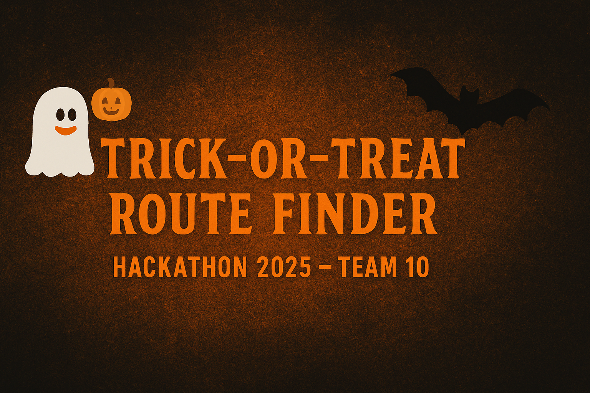
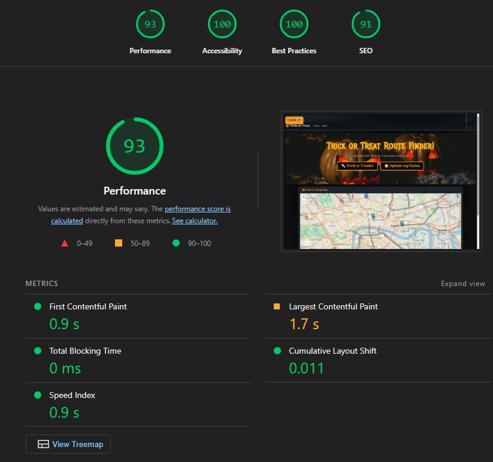
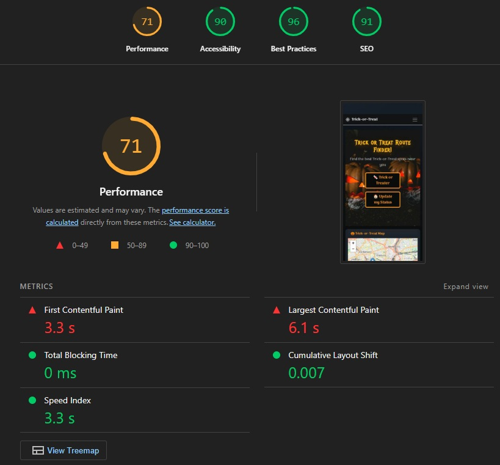

# Trick-or-Treat-Route-Finder

  

  <h1><strong>OCTOBER 2025</strong></h1>
  
This project was made as an entry to <strong>HALLOWEEN 2025</strong> HACK OR TREAT, organized by 
  

  

  
  
  
  

# 🎃 Project Summary

Trick-or-Treat Route Finder is a Halloween-themed web app that allows users to find, mark, and share the best trick-or-treat spots in their area.
It was created during Code Institute’s Hack or Treat 2025 Hackathon to combine fun, collaboration, and real-world mapping features.
Users can drop pins on a map to show houses giving candy, mark spots that have run out, or plan a safe route for trick-or-treating night.

# User Stories

## Features

### Homepage

Displays introduction and navigation to main features.

Includes Halloween-style animation with ghosts, bats, and spiders.

“Spooky” button toggles animations on/off for accessibility.

### Team Page

Responsive Bootstrap layout with member cards and images.

Includes interactive background animation and sparkle effects.

## Installation

1. Clone the repo:
https://github.com/trxdave/Trick-or-Treat-Route-Finder.git

2. Install dependencies:
pip install - r requirements.txt

3. Set up the database:
python manage.py migrate

4. Start the server:
python manage.py runserver

## Usage
- Navigate through the homepage and team page.
- Use the Spooky toggle to enable/disable animation.
- Future updates will include map pin creation and live candy status updates.

## The Team

Meet the caffeinated coders behind Trick or Treat:

### David "The Debugger" 🐛
- Set up the Django project structure and configured base settings (apps, URLs, static, templates).
- Implemented the Team page with Bootstrap cards, responsive layout, and animated Halloween-themed background (ghosts, bats, spiders 🕷️).
- Added a “Spooky” toggle button to control animation effects.
- Set up static file directories for CSS, JS, and images, including animation and sparkle cursor effects.
- Assisted with frontend integration and coordinated GitHub workflow for the team.
- Wrote the initial version of the README.md and general documentation.
- Suggested fun interactive ideas (sound effects “BOO!”, sparkle trails, and spooky visuals).
- Preparing for Heroku deployment setup.
- [GitHub](https://github.com/trxdave) | [LinkedIn](www.linkedin.com/in/david-cotter-junior-software-developer)

### Wireframes

* We used [Balsamiq](https://balsamiq.com/wireframes) to design the wireframes for us website.

# 🎯 Current Progress

## ✅ Tricks Done (Completed Features)

🧱 <strong>Project Setup:</strong> Django project created with apps for map and team pages.

🧹 <strong>Static Files:</strong> Configured static directories for CSS, JS, and images.

🧛 <strong>Team Page:</strong> Built responsive Bootstrap page with Halloween theme and member cards.

👻 <strong>Animated Background:</strong> Added spooky moving ghosts, bats, and spiders.

🎃 <strong>Spooky Toggle:</strong> “Spooky” button lets users turn animations on/off.

✨ <strong>Cursor Sparkles:</strong> Custom JS sparkle effect when moving the mouse.

🧠 <strong>Base Template:</strong> Added base.html with navigation, Bootstrap styling, and extendable blocks.

🖤 <strong>Frontend Style:</strong> Dark, orange, and white Halloween color palette.

🪄 <strong>Documentation:</strong> Started README and coordinated GitHub workflow.

💬 <strong>Team Support:</strong> Helped with setup issues and reviewed contributions.

# 🍬 Treats to Add (Next Steps)

🗺️ <strong>Map Integration:</strong> Allow clicking on the map to drop trick-or-treat spots.

📍 <strong>Database Models:</strong> Build models for locations and candy status updates.

💡 <strong>User Interaction:</strong> Replace address search with click-to-add pins.

🚀 <strong>Deployment:</strong> Set up Heroku deployment (with static + media support).

🧪 <strong>Testing:</strong> Validate all HTML, CSS, and Django logic.

📱 <strong>Optimization:</strong> Improve mobile responsiveness and accessibility.

## Performance

### Desktop Performance

| **Tested** | **Performance Score** | **View Result** | **Pass** |
--- | --- | --- | :---: |
|homepage| 100 / 100 | 

Screenshot of result

 | :white_check_mark:|
|Team| 98 / 100 | 

Screenshot of result

 | :white_check_mark:|

### Mobile Performance

| **Tested** | **Performance Score** | **View Result** | **Pass** |
--- | --- | --- | :---: |
|homepage| 90 / 100 | 

Screenshot of result

 | :white_check_mark:|
|Team| 90 / 100 | 

Screenshot of result

 | :white_check_mark:|

## Technologies Used

### Languages
- HTML5
- CSS3
- JavaScript
- Python

### Frameworks

- <strong>Django:</strong> A high-level Python web framework that encourages rapid development and clean design.
- <strong>Bootstrap 5:</strong> For responsive layout and styling.

## Code Validation

### HTML Validation
All pages validated using W3C HTML Validator, with Django template tags filtered out.

| **Tested** | **Result** | **View Result** | **Pass** |
--- | --- | --- | :---: |

### CSS Validation
Validated using W3C CSS Validator.

| **Tested** | **Result** | **View Result** | **Pass** |
--- | --- | --- | :---: |

# 🚀 Heroku Deployment Guide
To deploy Trick-or-Treat Route Finder on Heroku, follow these steps:

## Create the Heroku App
1. Log in to Heroku App
2. Click New - Create new app.
3. Give your app a unique name (trick-or-treat-route-finder)
4. Choose your nearest region (europe)

## Prepare Your Project
Ensure your project has the following files in the root directory:

- requirements.txt - pip freeze > requirements.txt
- Procfile - web: gunicorn trickortreat.wsgi
- runtime.txt - python-3.12.4

## Add and Commit the Files

- git add .
- git commit -m "Prepare for Heroku deployment"
- git push origin main

## Set Environment Variables
In your Heroku dashboard:
1. Go to Settings - Reveal Config Vars
2. Add your environment variables.

## Collect Static Files

- Heroku run - python manage.py collectstatic

## Migrate the Database

- Heroku run - python manage.py migrate

## Launch the App

Visit - https://trick-or-treat-route-finder-2a1f86fbfb2e.herokuapp.com/ 

## Acknowledgements
Special thanks to Code Institute for organizing the Hack or Treat 2025 hackathon 🎃
and to Team 10 for creativity, teamwork, and Halloween spirit! 👻

# Final
Made with 💀, ☕, and a touch of Halloween magic by Team 10 🎃 for the Code Institute Hack or Treat 2025 Hackathon.

“Because every coder deserves some candy.” 🍬

