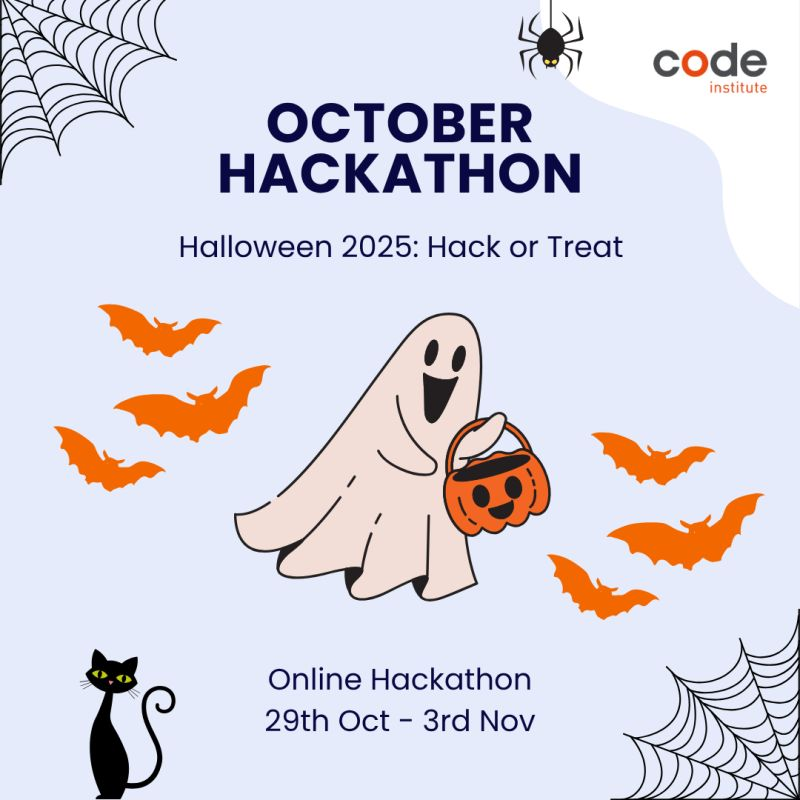

# Trick-or-Treat-Route-Finder
Trick-or-Treat Route Finder

  <h1><strong>OCTOBER 2025</strong></h1>
  
This project was made as an entry to <strong>HALLOWEEN 2025</strong> HACK OR TREAT, organized by 
  

  

  
  
  
  

# User Stories

## Features

### Homepage

## Installation

## Usage

## API Documentation

## The Team

Meet the caffeinated coders behind Trick or Treat:

### David "The Debugger" 🐛
- Backend Sorcerer
- Can smell a bug from a mile away
- [GitHub](https://github.com/trxdave) | [LinkedIn](www.linkedin.com/in/david-cotter-junior-software-developer)

## Entity-Relationship Diagram (ERD) Design

### Wireframes

* We used [Balsamiq](https://balsamiq.com/wireframes) to design the wireframes for us website.

## Performance

### Desktop Performance

| **Tested** | **Performance Score** | **View Result** | **Pass** |
--- | --- | --- | :---:

### Mobile Performance

| **Tested** | **Performance Score** | **View Result** | **Pass** |
--- | --- | --- | :---:

### Tested
| **Tested** | **Performance Score** | **View Result** | **Pass** |
--- | --- | --- | :---:

## Technologies Used

### Languages

### Frameworks

- <strong>Django:</strong> A high-level Python web framework that encourages rapid development and clean, pragmatic design. It provides robust features for building the backend, including user authentication, URL routing, and database management, ensuring a scalable and secure web application.

## Code Validation

### HTML Validation
ll pages were validated, and the code was pasted in. A filter was applied to remove issues related to the Django templating system. 

| **Tested** | **Result** | **View Result** | **Pass** |
--- | --- | --- | :---:

### CSS Validation

| **Tested** | **Result** | **View Result** | **Pass** |
--- | --- | --- | :---:

## Acknowledgements

